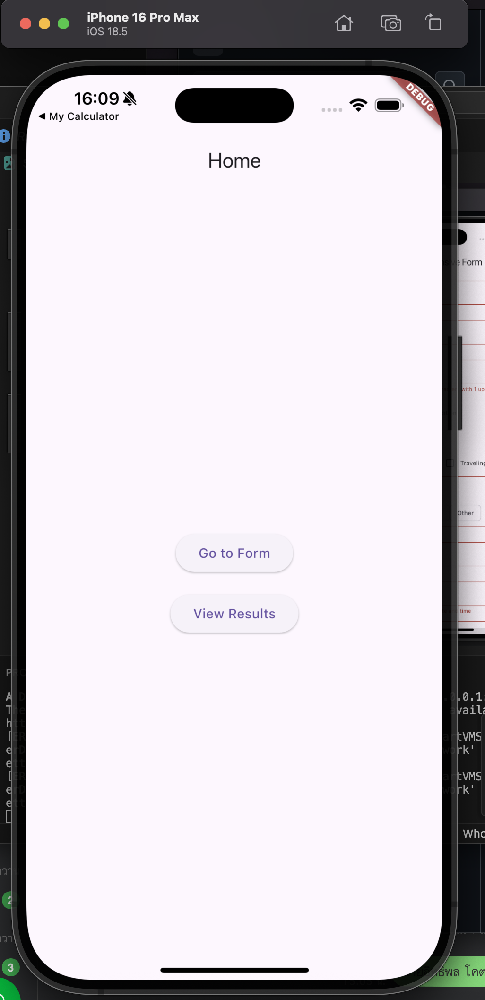
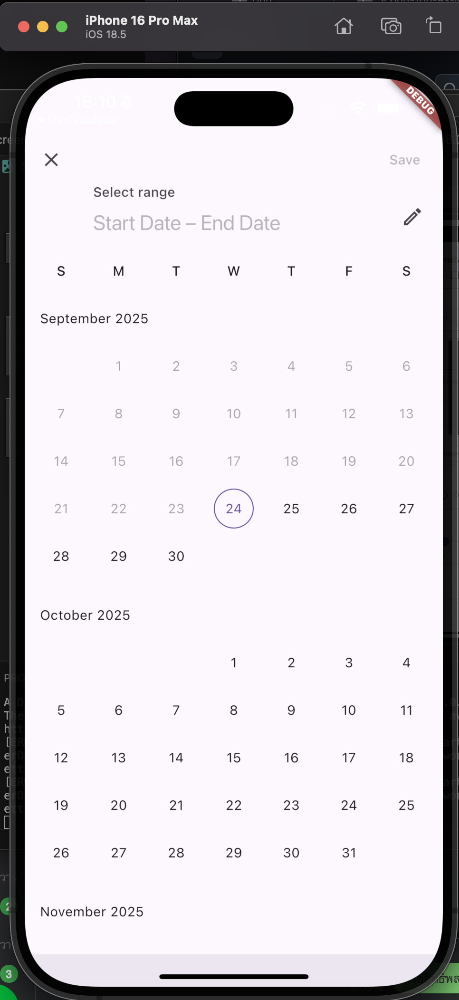
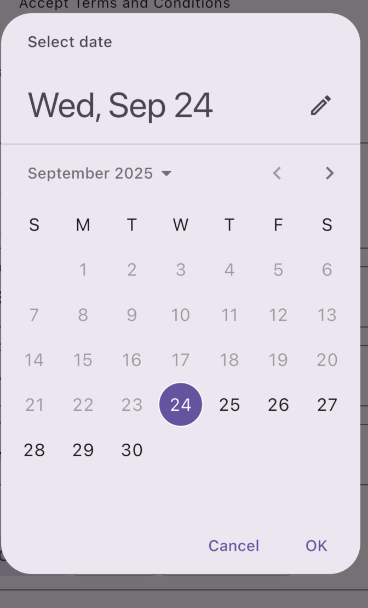
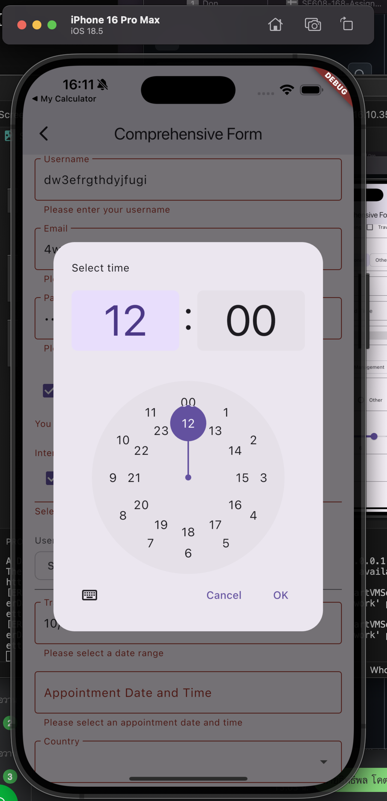
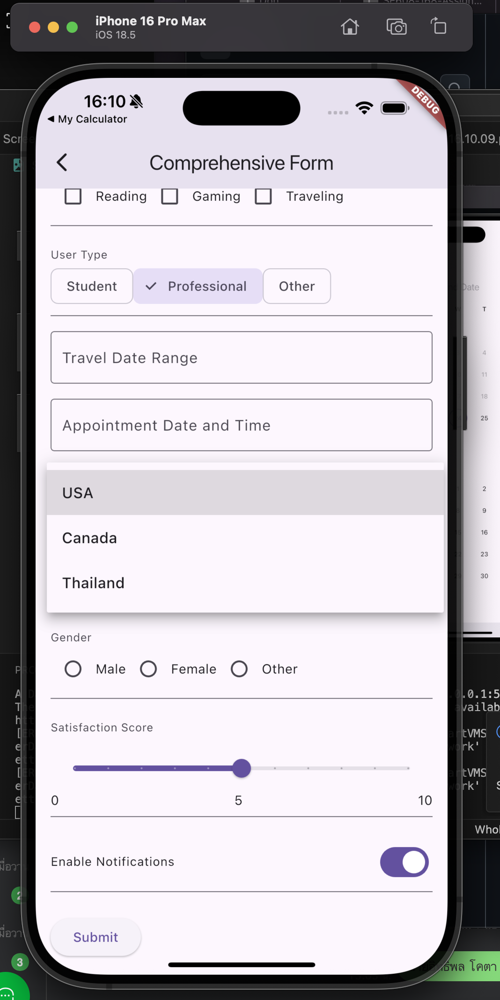

# 📋 Form Builder App

## อิทธิพล โคตา 66543210035-2

แอป Flutter สำหรับการสร้างและจัดการฟอร์ม โดยใช้ **flutter_form_builder**  
ผู้ใช้สามารถกรอกฟอร์ม → ตรวจสอบค่า → ส่งข้อมูลไปแสดงผลในอีกหน้า พร้อมแสดง Key/Value ของข้อมูลที่กรอก

---

## 🚀 Features
- ฟอร์มสมบูรณ์ด้วย **flutter_form_builder**
- ฟีเจอร์ฟอร์ม:
  - แบบฟอร์มลงทะเบียน
  - ฟิลด์ไดนามิก (เพิ่ม/ลดฟิลด์ได้)
  - เงื่อนไขการแสดงผล (Conditional fields)
  - การตรวจสอบค่าฟอร์ม (Validation)
- หน้า Preview สำหรับดูข้อมูลทั้งหมดที่กรอก แสดงเป็น Key/Value
- ออกแบบ UI ตามหลัก Material Design

---

## 📂 Project Structure
```
lib/
 ├── core/          # theme และ config
 ├── data/          # models
 ├── providers/     # state management (provider)
 ├── ui/            # หน้าจอ (screen) และ widget
 └── main.dart      # entry point
```

---

## ⚙️ Installation
1. ติดตั้ง Flutter SDK (>=3.8.0)
2. clone โปรเจกต์:
   ```bash
   git clone https://github.com/yourname/AS-06-Form_Builder.git
   cd AS-06-Form_Builder-main
   ```
3. ติดตั้ง dependencies:
   ```bash
   flutter pub get
   ```
4. รันแอป:
   ```bash
   flutter run
   ```

---

## 📦 Dependencies
- [flutter_form_builder](https://pub.dev/packages/flutter_form_builder)  
- [provider](https://pub.dev/packages/provider)  
- [intl](https://pub.dev/packages/intl)

---

## 🖼️ Screenshots
เพิ่ม screenshot ไว้ในโฟลเดอร์ `assets/screenshots` แล้วแสดงใน README ได้ดังนี้:
<p>
<br>
  
  <br>
  หน้าจอหลักจะมี 2 ปุ่มให้เลือก form,result
  <br>
  
  <br>
  ให้กรอก username email password และ ยอมรับเงื่อนไข
   <br>
  
  <br>
  เลือกความสนใจ ประเภทผู้ใช้ 
  <br>
  
  <br>
   เลือกวันที่ท่องเที่ยว
   <br>
  
   
    
    <br>
  เลือกวันนัดหมายและเวลา
  <br>
   
    
    <br>
    เลือกประเทศที่ต้องการ เลือกทักษะ เพศ ประเมินความพึงพอใจ
    <br>
  
  <br>
  กดปุ่ม submit เพื่อแสดงผลรวมทั้งหมด
  <br>
</p>

---


